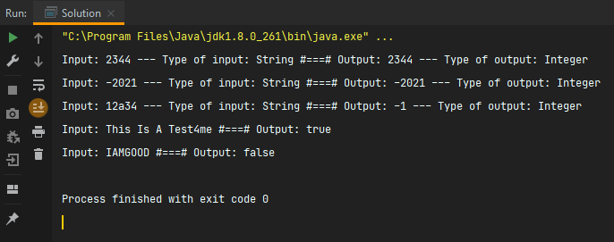
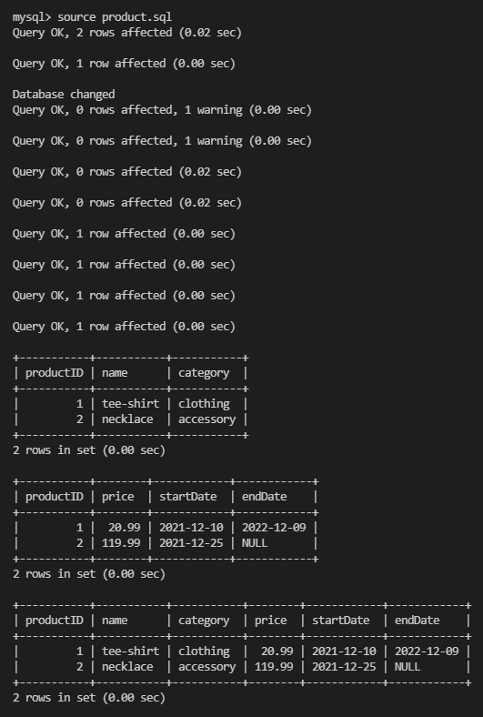

# Taboola Backend Engineer Intern Take Home Assessment

This is a take home assessment from Taboola. Start date: 12-01-2021

Terminal output
------------
Java terminal execution of Problem 1 and 2

----

SQL terminal execution of Problem 3



Directory Structure
------------

The directory structure of the Brain Tumor Segmentation project looks like this:
```
├── README.md                               <- The top-level README for developers using this project.
├── product.sql                             <- SQL script - Problem #3
├── execution_images                        <- Images of the terminal execution of the scripts
|   ├── Problem_1_&_2.png                   <- Execution Image for problem 1 and 2
|   └── Problem_3.png                       <- Execution Image for problem 3
└── src                                     <- All scripts to run this project
    └── Solution.java                       <- Contains solution to Problem #1 and #2


